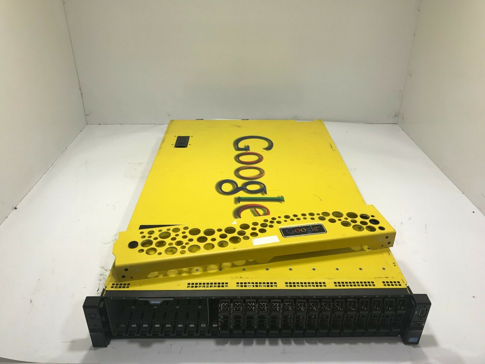
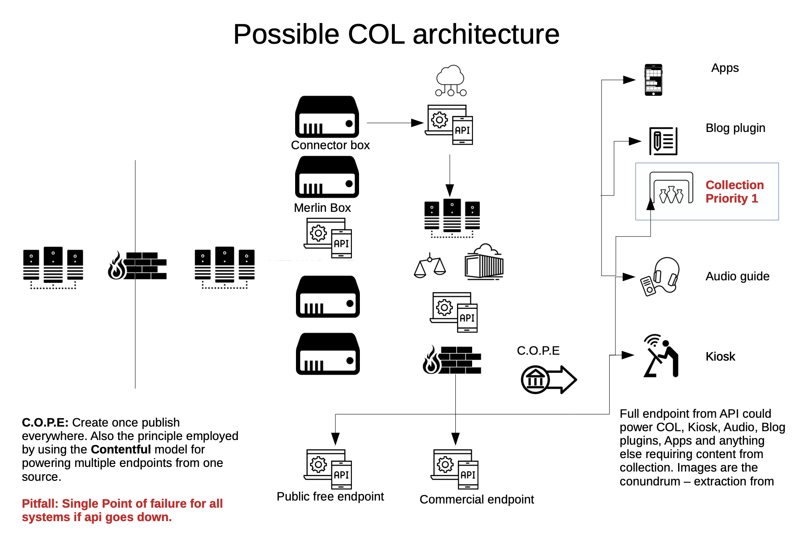
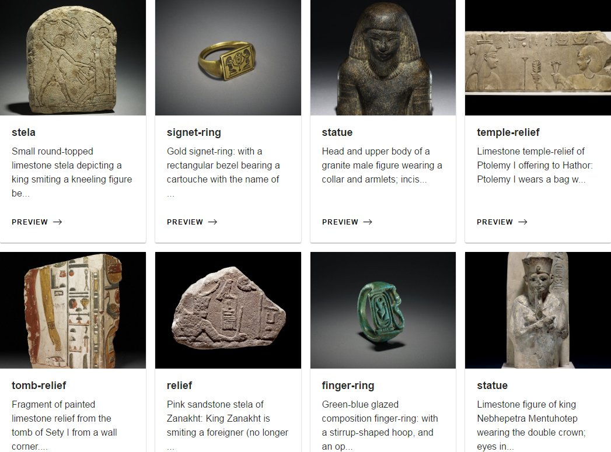

As part of the British Museum's failed attempt at digital transformation, we embarked on the installation of an 'enterprise' 
search solution from Google - their now defunct yellow boxes - the Search Appliance. 

This project cost hundreds of thousands of pounds (£475,000 for 3 years), but ultimately was not the solution that they needed. I was given this 
project after I returned from paternity leave in 2015, with the brief that this system was to replace the aging and failing 
Collection Online (which was not replaced until 2019, via the use of a [middleware solution](https://www.digitalmarketplace.service.gov.uk/digital-outcomes-and-specialists/opportunities/8780), which 
incidentally had facets of the recommendation I'd made. ) 

Unfortunately, GSA was basically a directory of page links with some meta data - so the fabulous team at ECS had to think 
of a solution that got round these limitations. By integrating with SSL's Index + API, the data was aggregated onto 
an Angular JS front end, which was then deployed using the styles provided by the BM digital team. 

The project was ultimately derailed by the Information Services division of the Museum being unwilling to support it in 
the workplace and blame for its procurement being passed around. The system was removed from use and all that remains as 
a trace for this project is a [web archive](https://web.archive.org/web/20170926200612/http://search.britishmuseum.org/#/home) page 
and the initial launch tweets.

<blockquote class="twitter-tweet">
Hello… is it ‘ancient Egypt’ you’re looking for? Today we launch a new search tool to help you explore! <a href="https://t.co/BV0mEKIBmB">https://t.co/BV0mEKIBmB</a> <a href="https://twitter.com/hashtag/musetech?src=hash&amp;ref_src=twsrc%5Etfw">#musetech</a> <a href="https://t.co/Ww2PujKN2E">pic.twitter.com/Ww2PujKN2E</a>
&mdash; British Museum (@britishmuseum) <a href="https://twitter.com/britishmuseum/status/800676280970674176?ref_src=twsrc%5Etfw">November 21, 2016</a></blockquote>  
