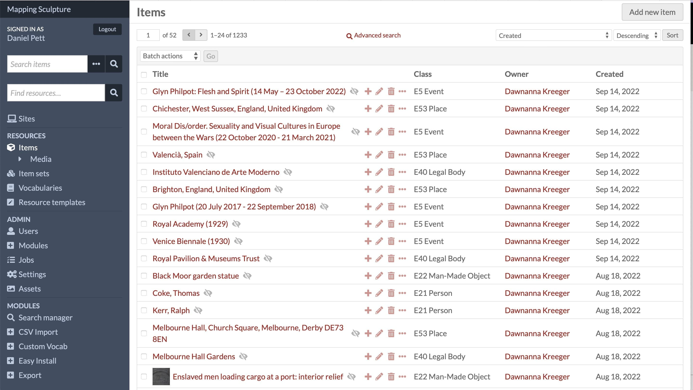

Towards the end of my time working at the Museum, a small database project came up for one of 
the Keepers of museum collections - Vicky Avery. She had been awarded funding to develop a database of 
sculptures representing Black people in museum collections in the United Kingdom. To enable this, I 
implemented:

* an Omeka S project website (only internal usage until research reaches critical mass), which 
enabled data collection
* IIIF images
* a logical CIDOC CRM mapped schema
* links to people and other entities
* mapping of objects to their current locations.

There's not much I can say about this project, as it's still in development, but it could end up being a 
very crucial piece of scholarship. 