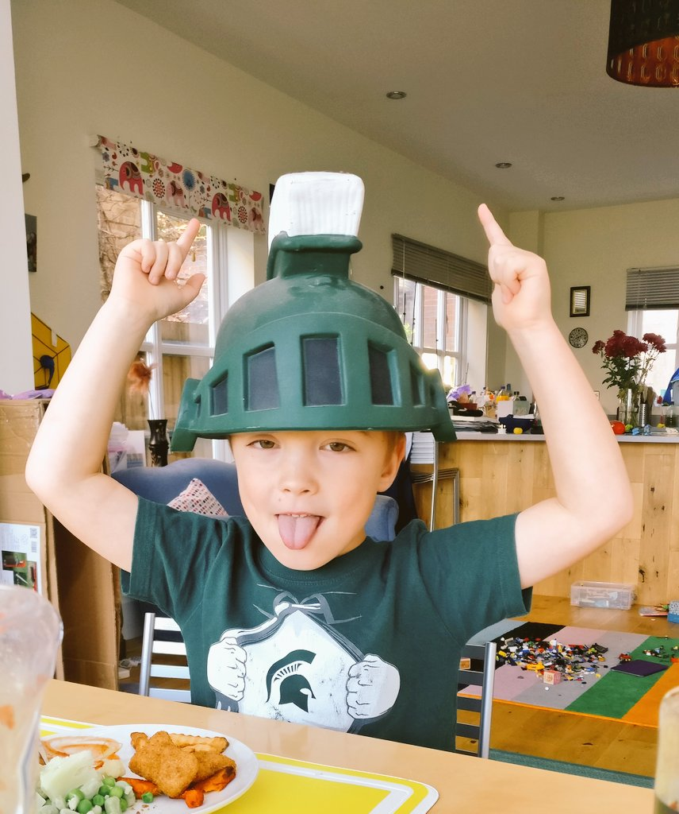

This project was one of the most influential experiences on my career - a National Endowment for the Humanities (NEH) funded Institute led by Ethan Watrall and Lynne Goldstein. 
It influenced so much of what I do now, it made me friends for life and if it could be done again, I would drop everything to go.

## About the project
Archaeology is in an age where digital methods and practices are having an unavoidable impact on all areas of the discipline.  Research, teaching, compliance, preservation, public engagement, and publication – all are being transformed by digital tools and technologies.  The problem is that  there are very few opportunities for students, scholars, professional archaeologists, or closely related disciplines to build these vital digital skills. The Institute on Digital Archaeology Method & Practice hopes to address this by providing invited attendees the opportunity to receive hands-on instruction and experience in a wide variety of critical digital skills, tools, and technologies – especially those that fall outside the “traditional” suite of digital tools with which many archaeologists are already comfortable (CAD, GIS, databases, etc).

### Institute Themes

The activities of the Institute for Digital Archaeological Method & Practice (lectures, workshops, etc) are organized to address a variety of themes:

* Geospatial & Digital Cultural Mapping: the geospatial web, with particular emphasis on low cost or open source tools to display, visualize, share, publish, and creatively combine geospatial data for research, scholarly communication, and public engagement. Articulates with any existing “traditional” GIS experience that invited attendees may have, and draws heavily on the domain of Neogeography.
* Publication and Scholarly Communication: the radically changing landscape of scholarly publishing and communication, and the ways in which archaeologists (public, private, scholarly, or student) can leverage new digital tools and platforms to build, publishing, and widely disseminate engaging archaeological “publications.”
* Data, Linked Data, and Digital Libraries: digital archaeological data standards and platforms (both centralized and decentralized). Promote best practices as well as legal and technical standards for making archaeological data useful, usable, open, sharable. Methods, tools, and best practices for building digital libraries and repositories for preservation and access of archaeological materials, data, and information.
* Public Outreach & Engagement: using a wide range of digital tools and techniques to engage with the public over issues of archaeological resources, preservation, and archaeological education.
* 3D & Augmented Reality: Low cost and low friction methods, tools, and best practices to capture and present archaeological materials in 3D for research, publication, teaching, or public engagement. Special emphasis on physical, real-world environment whose elements are augmented by computer-generated sensory input such as sound, video, digital imagery or geospatial data and information.
* Project Development & Management: the practical, day-to-day work and intangible aspects of developing and managing digital archaeology projects. Including issues of digital archaeological project sustainability.

## What did people do?

Over a two year cycle, a group of scholars worked on digital archaeology projects, relevant to their careers and were tutored for two 
weeks by experts in the field. The projects were then presented in the final week of the Institute at Michigan State University, East Lansing. 

<blockquote class="twitter-tweet">
But, wow. Reflecting, and it&#39;s true. If it weren&#39;t for <a href="https://twitter.com/hashtag/msudai?src=hash&amp;ref_src=twsrc%5Etfw">#msudai</a> I wouldn&#39;t have gone to SAA in 2016 and met all the digi folks there or taken <a href="https://twitter.com/benmarwick?ref_src=twsrc%5Etfw">@benmarwick</a> and <a href="https://twitter.com/Md_Harris?ref_src=twsrc%5Etfw">@Md_Harris</a> R workshop in Vancouver or become co-chair of <a href="https://twitter.com/SAA_DDIG?ref_src=twsrc%5Etfw">@SAA_DDIG</a> this year. Or a million other things. Thanks, <a href="https://twitter.com/NEH_ODH?ref_src=twsrc%5Etfw">@NEH_ODH</a>.
&mdash; Jolene Smith (@aejolene) <a href="https://twitter.com/aejolene/status/990739999204302856?ref_src=twsrc%5Etfw">April 29, 2018</a></blockquote> 
