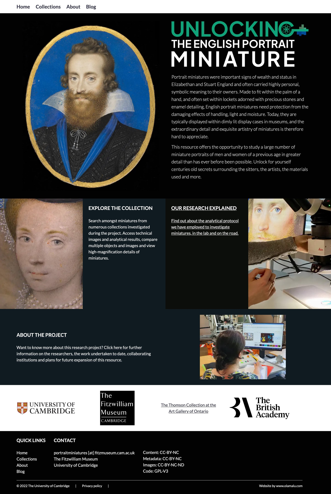
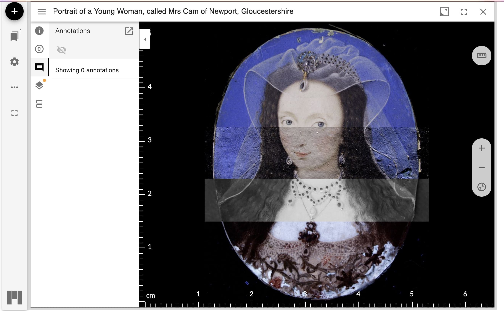

## What was this project about?

Portrait miniatures were important signs of wealth and status in Elizabethan and Stuart England and often carried highly
personal, symbolic meaning to their owners. Made to fit within the palm of a hand, and often set within lockets adorned
with precious stones and enamel detailing, English portrait miniatures need protection from the damaging effects of
handling, light and moisture. Today, they are typically displayed within dimly lit display cases in museums, and the extraordinary
detail and exquisite artistry of miniatures is therefore hard to appreciate.


## What was the digital resource meant to do?

This resource offers the opportunity to study a large number of miniature portraits of men and women of a previous age
in greater detail than has ever before been possible. Unlock for yourself centuries old secrets surrounding the sitters,
the artists, the materials used and more.

## What was developed for this project?

This project sat outside the Fitzwilliam Museum's usual data structures - it aggregated data from collections
that supplemented data held by the Museum, with data from Museums and private individual collections around the world.
As such
the Museum's collections management system and the structures in place didn't provide the best foundation for the
project.

To get round this, we decided to:

* Use DirectUs 9 as a CMS to hold the data 
* Use Gatsby to interface with the CMS via GraphQL and build the front end and host it on GitHub pages (zero cost)
* Use Cantaloupe to serve IIIF images via the Museum research server, with the actual images deployed off S3 buckets 
* Build custom manifests for each object via a Node JS project 
* Create plugins for Mirador to display the IIIF images 
  * Ruler
  * Raking light
  * Natural light
  * UV light
  * Infrared light

Olamalu were engaged to do the design and build, after a competitive tender process, and they were
project managed by our excellent Digital Project Manager, Megan Bushnell (now working at SAS, University of London.)

## Screenshots of the project



Collections listing page provided the access point to all the portrait miniatures that were analysed.


The Mirador viewer was extended to allow for the display of different light sources, opacity of layers, annotations and a 
ruler to measure the object. 



## IIIF data and manifest augmentation

We used Cantaloupe to deliver our IIIF data and their basic manifests produced this json result:

```json
{
  "@context": "http://iiif.io/api/image/3/context.json",
  "id": "http://iiif.fitz.ms/iiif/3/037b074e-f999-47a7-9a54-80622ff15b6f.tif",
  "type": "ImageService3",
  "protocol": "http://iiif.io/api/image",
  "profile": "level2",
  "width": 2560,
  "height": 1920,
  "maxArea": 4915200,
  "sizes": [
    {
      "width": 160,
      "height": 120
    },
    {
      "width": 320,
      "height": 240
    },
    {
      "width": 640,
      "height": 480
    },
    {
      "width": 1280,
      "height": 960
    },
    {
      "width": 2560,
      "height": 1920
    }
  ],
  "tiles": [
    {
      "width": 256,
      "height": 256,
      "scaleFactors": [
        1,
        2,
        4,
        8,
        16
      ]
    }
  ],
  "extraQualities": [
    "bitonal",
    "color",
    "gray"
  ],
  "extraFormats": [
    "tif",
    "gif"
  ],
  "extraFeatures": [
    "baseUriRedirect",
    "canonicalLinkHeader",
    "cors",
    "jsonldMediaType",
    "mirroring",
    "profileLinkHeader",
    "regionByPct",
    "regionByPx",
    "regionSquare",
    "rotationArbitrary",
    "rotationBy90s",
    "sizeByConfinedWh",
    "sizeByH",
    "sizeByPct",
    "sizeByW",
    "sizeByWh"
  ]
}
```
This manifest needed to be updated and supplemented for the project, so Olamulu built a Node JS project to do this. 
The resulting manifest was then rendered as:

```json
{
  "@context": "http://iiif.io/api/presentation/3/context.json",
  "id": "https://miniatures-iiif.fitzmuseum.cam.ac.uk/AGOID.29376/manifest.json",
  "type": "Manifest",
  "label": {
    "en": [
      "Portrait of a Young Woman, called Mrs Cam of Newport, Gloucestershire"
    ]
  },
  "summary": {
    "en": [
      "UV image: loss of colours are evident in the lower part of the miniature, which appears white as the parchment and does not show the orange UV colour typical of lead white, used for the dress. Other retouched areas are evident on the background, at the top and right side.\nThe calcium and lead MA-XRF maps show a possible change in the length of the hair."
    ]
  },
  "requiredStatement": {
    "label": {
      "en": [
        "Collection"
      ]
    },
    "value": {
      "en": [
        "Fitzwilliam Museum"
      ]
    }
  },
  "rights": "http://creativecommons.org/licenses/by-nc-nd/4.0/",
  "items": [
    {
      "id": "https://miniatures-iiif.fitzmuseum.cam.ac.uk/AGOID.29376/canvas/0",
      "type": "Canvas",
      "height": 3895,
      "width": 3053,
      "items": [
        {
          "id": "https://miniatures-iiif.fitzmuseum.cam.ac.uk/AGOID.29376/page/0/0",
          "type": "AnnotationPage",
          "items": [
            {
              "id": "https://miniatures-iiif.fitzmuseum.cam.ac.uk/AGOID.29376/painting/0",
              "type": "Annotation",
              "motivation": "painting",
              "body": {
                "type": "Choice",
                "items": [
                  {
                    "id": "https://iiif.fitz.ms/iiif/3/35c6a5ef-7d3c-4196-9d4e-74dd7d16e954.jpg/full/max/0/default.jpg",
                    "type": "Image",
                    "format": "image/jpeg",
                    "height": 3895,
                    "width": 3053,
                    "label": {
                      "en": [
                        "Natural Light"
                      ]
                    },
                    "service": [
                      {
                        "id": "https://iiif.fitz.ms/iiif/3/35c6a5ef-7d3c-4196-9d4e-74dd7d16e954.jpg",
                        "type": "ImageService3",
                        "profile": "level2"
                      }
                    ]
                  },
                  {
                    "id": "https://iiif.fitz.ms/iiif/3/2a81a8dd-8935-42c5-8dd9-2d39a44c51b4.jpg/full/max/0/default.jpg",
                    "type": "Image",
                    "format": "image/jpeg",
                    "height": 3895,
                    "width": 3053,
                    "label": {
                      "en": [
                        "Raking Light"
                      ]
                    },
                    "service": [
                      {
                        "id": "https://iiif.fitz.ms/iiif/3/2a81a8dd-8935-42c5-8dd9-2d39a44c51b4.jpg",
                        "type": "ImageService3",
                        "profile": "level2"
                      }
                    ]
                  },
                  {
                    "id": "https://iiif.fitz.ms/iiif/3/2162870a-6bfa-440c-ad0b-b92f23e65ced.jpg/full/max/0/default.jpg",
                    "type": "Image",
                    "format": "image/jpeg",
                    "height": 3895,
                    "width": 3053,
                    "label": {
                      "en": [
                        "Infrared"
                      ]
                    },
                    "service": [
                      {
                        "id": "https://iiif.fitz.ms/iiif/3/2162870a-6bfa-440c-ad0b-b92f23e65ced.jpg",
                        "type": "ImageService3",
                        "profile": "level2"
                      }
                    ]
                  },
                  {
                    "id": "https://iiif.fitz.ms/iiif/3/569a8cae-6c40-4962-bc6d-363534538552.jpg/full/max/0/default.jpg",
                    "type": "Image",
                    "format": "image/jpeg",
                    "height": 3895,
                    "width": 3053,
                    "label": {
                      "en": [
                        "Ultraviolet"
                      ]
                    },
                    "service": [
                      {
                        "id": "https://iiif.fitz.ms/iiif/3/569a8cae-6c40-4962-bc6d-363534538552.jpg",
                        "type": "ImageService3",
                        "profile": "level2"
                      }
                    ]
                  }
                ]
              },
              "target": "https://miniatures-iiif.fitzmuseum.cam.ac.uk/AGOID.29376/canvas/0"
            }
          ]
        }
      ],
      "physicalDimensions": {
        "type": "PhysicalDimension",
        "profile": "http://iiif.io/api/annex/extensions/physdim",
        "physicalScale": 0.0139,
        "physicalUnits": "mm"
      },
      "annotations": [
        {
          "id": "https://miniatures-iiif.fitzmuseum.cam.ac.uk/AGOID.29376/page/0/0",
          "type": "AnnotationPage",
          "items": []
        }
      ]
    }
  ]
}
```